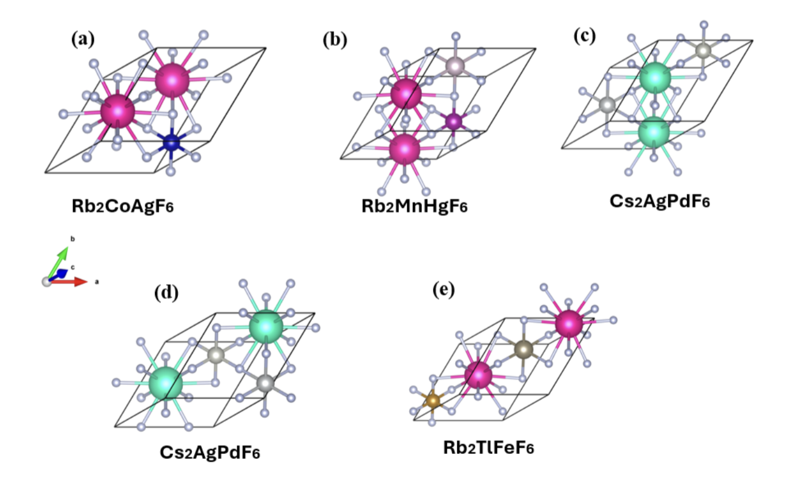

# Llama 3.1 8B Large Language Model

This is the Large Language Model (LLM) used in our paper to generate novel structures for TMO battery usage.



To setup the environment, run:

```
source install.sh
```

Train the model by running:

```
python llama_finetune.py --run-name 7b-test-run --model 7b
```

To evaluate the results run:

```
python test_feasibility.py --output_dir ./path/to/your/generated/cif/files
```