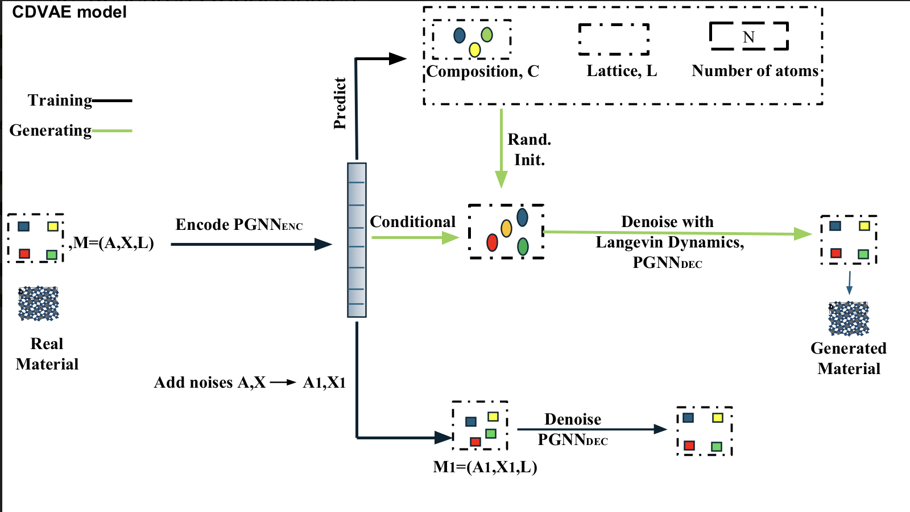
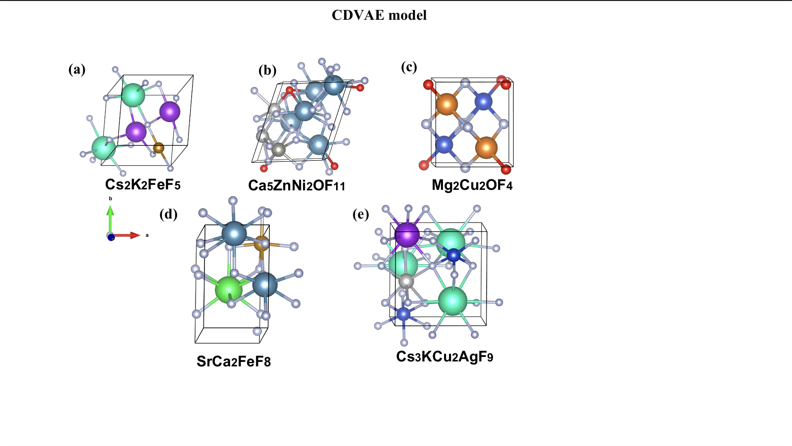

# Crystal Diffusion Variational AutoEncoder

This is the Crystal Diffusion Variational AutoEncoder (CDVAE) used in our paper to generate novel structures for transitional metal battery usage.

Our trained model is provided in the ```custom``` folder for users to recreate our results and instructions are provided to train a custom model on a cusotm dataset.

[[Paper]](https://linkhere.com) [[Original Paper]](https://arxiv.org/abs/2110.06197)  [[Datasets]](data/)

<p align="center">
   
</p>

<p align="center">
  
</p>


## Table of Contents

- [Installation](#installation)
- [Datasets](#datasets)
- [Training CDVAE](#training-cdvae)
- [Generating materials](#generating-materials)
- [Evaluating materials](#evaluate-validity-of-strucutres)
- [Evaluating model](#evaluating-model)
- [Authors and acknowledgements](#authors-and-acknowledgements)
- [Citation](#citation)
- [Contact](#contact)

## Installation

If your device does not have a GPU:

Run ```source install_cpu.sh```

If your device has a GPU with CUDA cores, run 

Run ```source install_cuda.sh```

## Datasets

If you want to use a custom dataset, place your **train.csv**, **test.csv**, and **val.csv** in the `/data/custom` folder.

## Training CDVAE

### Training without a property predictor

To train a CDVAE, with your own dataset run the following command:

```
python cdvae/run.py data=custom expname=custom
```

If training with a custom dataset, ensure to go to `conf/data/custom.yaml` and change the `prop` field to the name of the desired property to optimize **(ex. formation energy)** in the CSV file.

To use prebuilt datasets, use `data=carbon`, `data=mp_20`,  `data=perov` instead. CDVAE uses [hydra](https://hydra.cc) to configure hyperparameters, and users can modify them with the command line or configure files in `conf/` folder.

After training, model checkpoints can be found in `$HYDRA_JOBS/singlerun/YYYY-MM-DD/expname`.

### Training with a property predictor

Users can also additionally train an MLP property predictor on the latent space, which is needed for the property optimization task:

```
python cdvae/run.py data=[dataset] expname=[dataset] model.predict_property=True
```

The name of the predicted propery is defined in `data.prop`, as in `conf/data/perov.yaml` for Perov-5.

## Generating materials

To generate materials from the preexisting trained model, run the following command:

```
python scripts/evaluate.py --model_path /full/path/to/project/custom --tasks recon gen
```

Then run the following command to convert the generated pytorch pickles to CIF files:

```
python scripts/convert_to_cif.py
```

To generate materials from your own trained model, run the following command:

```
python scripts/evaluate.py --model_path MODEL_PATH --tasks recon gen opt
```

`MODEL_PATH` will be the path to the trained model. Users can choose one or several of the 3 tasks:

- `recon`: reconstruction, reconstructs all materials in the test data. Outputs can be found in `eval_recon.pt`l
- `gen`: generate new material structures by sampling from the latent space. Outputs can be found in `eval_gen.pt`.
- `opt`: generate new material strucutre by minimizing the trained property in the latent space (requires `model.predict_property=True`). Outputs can be found in `eval_opt.pt`.

`eval_recon.pt`, `eval_gen.pt`, `eval_opt.pt` are pytorch pickles files containing multiple tensors that describes the structures of `M` materials batched together. Each material can have different number of atoms, and we assume there are in total `N` atoms. `num_evals` denote the number of Langevin dynamics we perform for each material.

- `frac_coords`: fractional coordinates of each atom, shape `(num_evals, N, 3)`
- `atom_types`: atomic number of each atom, shape `(num_evals, N)`
- `lengths`: the lengths of the lattice, shape `(num_evals, M, 3)`
- `angles`: the angles of the lattice, shape `(num_evals, M, 3)`
- `num_atoms`: the number of atoms in each material, shape `(num_evals, M)`

Then run the following command to convert the pytorch pickles to CIF files:

```
python scripts/convert_to_cif.py
```

## Evaluate validity of strucutres

To evaluate the validity of structures: 
- **Deactivate the Conda environment** and ensure you have a Python version atleast 3.11  
- Go to [https://www.dgl.ai/pages/start.html](https://www.dgl.ai/pages/start.html) and first install the DGL version compatible with your system
- Then install the ALIGNN pip package by running  ```pip install alignn```

Then run ``` python scripts/test_feasibility.py ``` to generate CSV files evaluating the generated structures.

## Evaluating model

To compute evaluation metrics, run the following command:

```
python scripts/compute_metrics.py --root_path MODEL_PATH --tasks recon gen opt
```

`MODEL_PATH` will be the path to the trained model. All evaluation metrics will be saved in `eval_metrics.json`.


## Authors and acknowledgements

The software is primary written by [Tian Xie](www.txie.me), with signficant contributions from [Xiang Fu](https://xiangfu.co/).

Updates are by [Amruth Nadimpally](https://github.com/amruthn1).

The GNN codebase and many utility functions are adapted from the [ocp-models](https://github.com/Open-Catalyst-Project/ocp) by the [Open Catalyst Project](https://opencatalystproject.org/). Especially, the GNN implementations of [DimeNet++](https://arxiv.org/abs/2011.14115) and [GemNet](https://arxiv.org/abs/2106.08903) are used.

The main structure of the codebase is built from [NN Template](https://github.com/lucmos/nn-template).

For the datasets, [Perov-5](data/perov_5) is curated from [Perovksite water-splitting](https://cmr.fysik.dtu.dk/cubic_perovskites/cubic_perovskites.html), [Carbon-24](data/carbon_24) is curated from [AIRSS data for carbon at 10GPa](https://archive.materialscloud.org/record/2020.0026/v1), [MP-20](data/mp_20) is curated from [Materials Project](https://materialsproject.org).

## Citation

Please consider citing the following paper if you find our code & data useful.

```
@article{xie2021crystal,
  title={Crystal Diffusion Variational Autoencoder for Periodic Material Generation},
  author={Xie, Tian and Fu, Xiang and Ganea, Octavian-Eugen and Barzilay, Regina and Jaakkola, Tommi},
  journal={arXiv preprint arXiv:2110.06197},
  year={2021}
}
```

``` 
ADD CITATION HERE WHEN PUBLISHED 
```

## Contact

Please leave an issue or reach out to Tian Xie (txie AT csail DOT mit DOT edu) if you have any questions.
