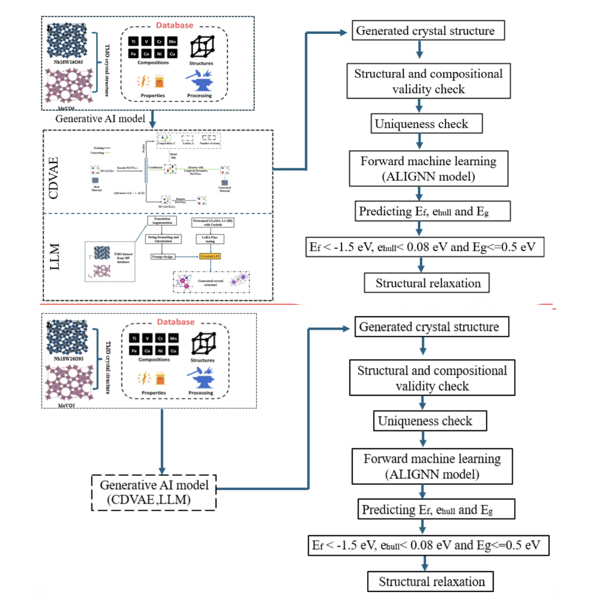

# Generative AI for Discovering Porous Oxide Materials for Next-Generation Energy Storage

This project contains two Generative AI models (CDVAE and LLM) we utilized with modifications and extra utilities written in order to generate crystal structures for TMO (transitional metal oxide) batteries.

Ensure to keep both folders as each project contains files which the other depends on.

Original Projects Are:

- CDVAE -> https://github.com/txie-93/cdvae
- Crystal-Text-LLM -> https://github.com/facebookresearch/crystal-text-llm

An abstraction of our methodology is provided below:




## Citation

```
@misc{datta2024generativeaidiscoveringporous,
      title={Generative AI for Discovering Porous Oxide Materials for Next-Generation Energy Storage}, 
      author={Joy Datta and Dibakar Datta and Amruth Nadimpally and Nikhil Koratkar},
      year={2024},
      eprint={2410.06433},
      archivePrefix={arXiv},
      primaryClass={cond-mat.mtrl-sci},
      url={https://arxiv.org/abs/2410.06433}, 
}
```


### Authors

- [@amruthn1](https://www.github.com/amruthn1)
- [@joy1303125](https://github.com/joy1303125)
